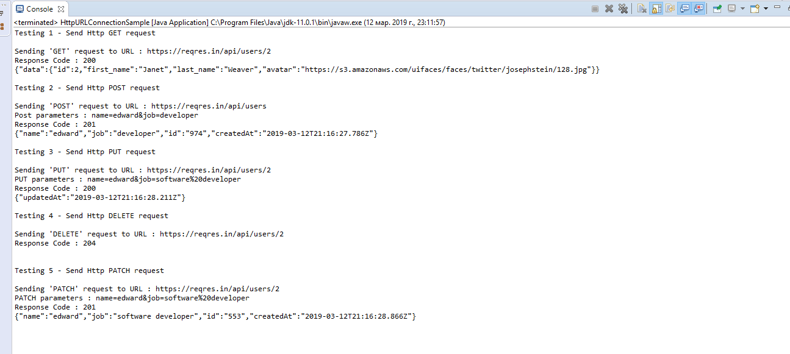

# HTTP
## Laboratorul 3

##### Executia programului
<dl>
<dt>Metodele utilizate:</dt>
</dl>

 **GET**: fiind utilizată atunci când serverului i se cere o resursă.

 **POST**: a fost proiectată pentru a trimite date de intrare către server.

 **PUT**: metoda este folosită pentru a depune documente pe server, fiind inversul metodei GET.

 **DELETE**: este opusul metodei PUT.

<dl>
<dt>Raspunsuri HTTP:</dt>
</dl>

 **200** - ok:
Această cerere a fost executată cu succes. Informația a revenit cu un răspuns pozitiv, indiferent de modul în care s-a făcut cererea.

  

